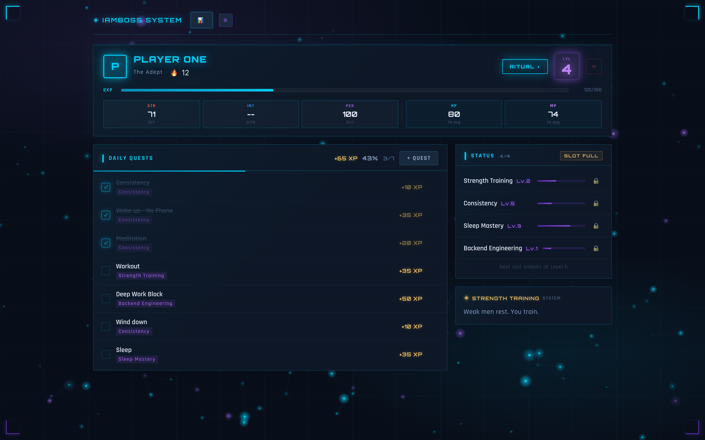
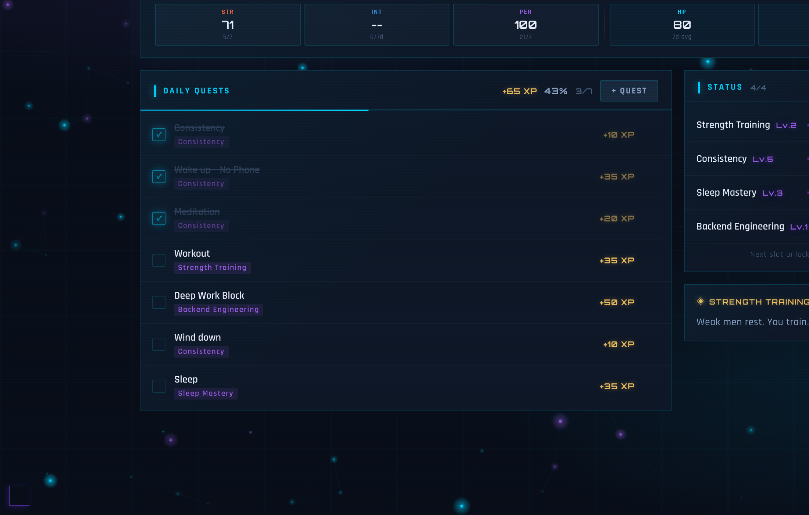
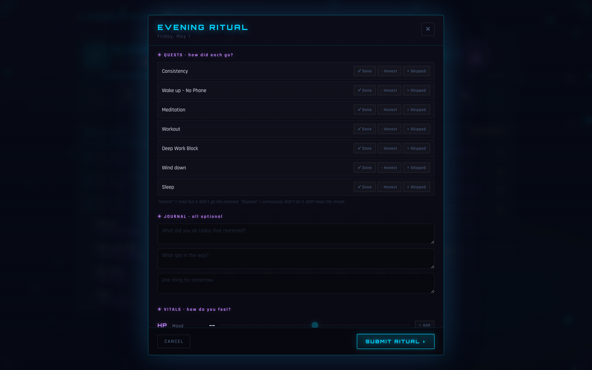
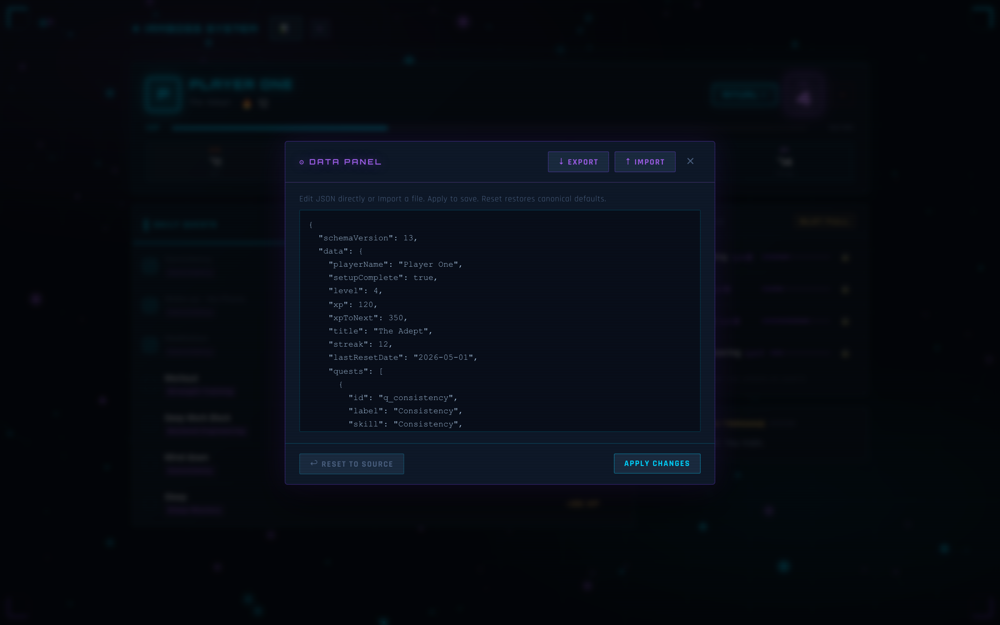
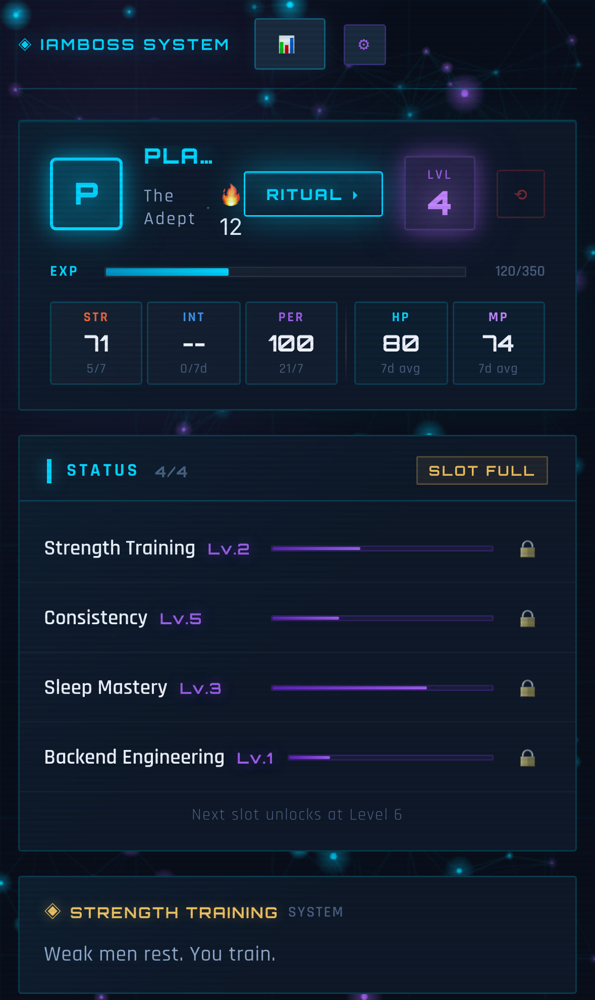

# iamboss

> Solo Leveling–style HUD for your daily routine. Quests, XP, streaks, anti-perfectionism mechanics — built for myself, shared because the design is opinionated enough to be useful.

<p align="center">
  
</p>

## What it is

A single-page web app that wraps a normal day in a futuristic-fantasy-system overlay:

- Schedule blocks → **quests** with categories (body, ritual, work, mind, recovery)
- Follow-through → **XP**, **levels**, per-skill progression
- Showing up → **streaks**
- Real life happening → **Honest** and **Skipped** statuses that preserve the streak instead of breaking it (anti-perfectionism by design)
- End-of-day **ritual** with mood/energy logging
- 7-day rolling **stats** (STR / INT / PER / HP / MP) derived live from ritual history

State persists locally — no backend, no account, no telemetry.

## Why I built it

I respond well to game-mechanics framing, so I built one and use it daily. The design rules are anti-perfectionism on purpose: every mechanism (Honest status, no penalties, streak that survives a missed day) exists because the system has to outlive a broken streak — otherwise it stops working the moment life gets in the way.

It's not for everyone. It's a portfolio-grade artifact of my own daily tool.

## Tech

- **Vite 5** + **React 19** + **TypeScript**
- **Zustand** with `persist` middleware (versioned, with migrations v1→v13)
- Custom CSS only — no UI library
- **Playwright** test suite
- `localStorage` (key: `iamboss_state`) is the only persistence layer

## Screenshots

<p align="center">
  
  
</p>

<p align="center">
  
  
</p>

## Run locally

Requires Node 22.9+ (Vite 5 / Playwright compatible).

```bash
git clone https://github.com/HarshPatel7x/iamboss.git
cd iamboss
npm install
npm run dev          # → http://localhost:5173
```

## Build & test

```bash
npm run build        # tsc + vite build
npm run lint         # eslint
npm test             # playwright (headless)
npm run test:ui      # playwright UI mode
npm run test:headed  # playwright with browser visible
```

## Architecture notes

The codebase is opinionated about a few things — see [AGENTS.md](./AGENTS.md) for the full conventions doc. Highlights:

- **All state mutations go through Zustand actions.** No `setState` in components.
- **All TypeScript types live in `src/types/index.ts`.** Never inlined.
- **All defaults live in `src/data/canonicalData.ts`.** The store imports them; nothing else hardcodes initial data.
- **Schema changes require a migration.** `persist` version is bumped + a `migrate` block is added in `src/store/migrations.ts`. Once a migration version has shipped to a user's storage, that block is frozen — new behavior requires a new version.
- **Stats are derived, not persisted.** STR/INT/PER/HP/MP compute live from the rituals window via `src/utils/stats.ts`.

## Roadmap (maybe)

- Optional cloud sync (currently local-only by design)
- Keyboard shortcuts for quest completion
- Weekly review screen

No promises. This is a personal tool that escaped.

## License

MIT — see [LICENSE](./LICENSE).
